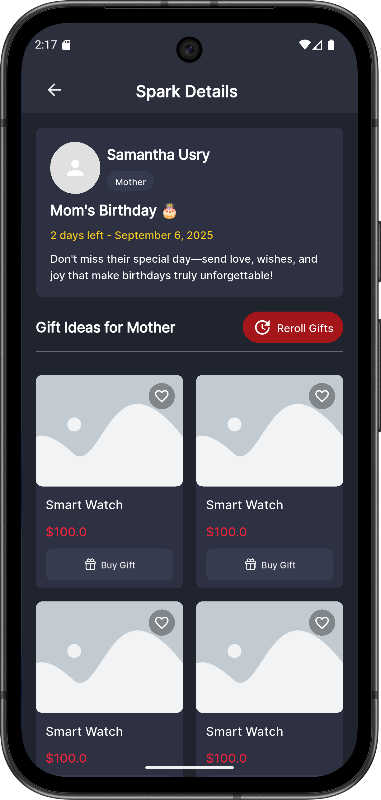
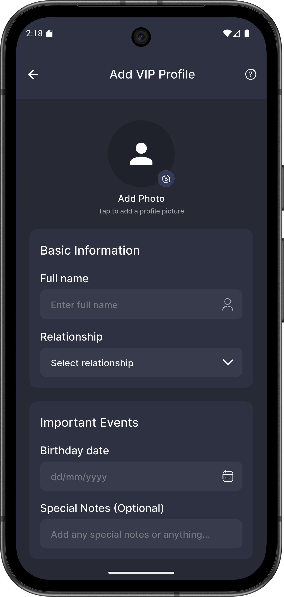

# 📱 Kashirons Mobile App – BroBrain | SQA Testing Report

### 👩‍💻 Tested By: Md Abdur Rahaman Tutul  
**Role:** Software Quality Assurance (SQA) Engineer  
**Team:** SQA Team – FSD – Softvence (Alpha)

---

## 🧪 Project Overview

This repository contains the **UI flow and functional testing report** for the **Kashirons Mobile App – BroBrain** project.  
The testing was performed on the **mobile application’s user interface (UI only)** — API integration was not implemented during the testing phase.

All identified issues and bugs were reported in the **Notion-based Bug Tracker**, and assigned to the **Flutter Developer Team** for resolution.

---

## 🎯 Testing Objectives

- Validate the mobile app’s **UI flow** against the [Figma Design](https://www.figma.com/design/LNjgJX3njbhdHtybu0WyY7/kashirons-%7C%7C-webgenious0-%7C%7C-FO62EF5392748?node-id=804-24216&p=f&t=F2XkGkAzKPltiZnw-0)
- Perform **functional testing** on implemented screens
- Identify **visual, navigation, and usability issues**
- Log and track bugs in **Notion Bug Tracker**

---

## 📋 Test Management

All testing activities were tracked using the **Notion Bug Tracker**.

🔗 **Bug Tracker Link:**  
[View Bug Tracker in Notion](https://www.notion.so/28ca27313a3e80228f4eefda7d08a1b5?v=28ca27313a3e81c3b14b000c062e2920&source=copy_link)

---

## 🐞 Sample Bug Report Format

| **Bug ID** | **Feature** | **Bug Title** | **Severity** | **Priority** | **Issue Labels** | **Description** | **Bug Type** | **Steps to Reproduce** | **Actual Result** | **Expected Result** | **Screenshot** | **Dev Status** | **Resolution Date** | **Date Reported** |
|-------------|--------------|---------------|---------------|---------------|------------------|------------------|---------------|-------------------------|-------------------|---------------------|----------------|----------------|----------------------|--------------------|
| B001 | Login Screen | Button misaligned on small devices | Medium | High | UI / Layout | The “Login” button overlaps footer content | UI Bug | 1. Open app → 2. Navigate to Login → 3. Observe button alignment | Button overlaps footer | Button properly aligned | Screenshot_20251016_140451.png | Fixed | 2025-10-16 | 2025-10-15 |
| B002 | Registration | Missing validation for phone field | High | High | Validation | Phone input accepts letters | Functional Bug | 1. Go to Register page → 2. Enter text instead of digits → 3. Click Submit | App accepts invalid input | Input should only allow digits | Screenshot_20251016_141727.png | In Progress | — | 2025-10-15 |

> 🧩 **Note:** The complete list of identified issues is available in the Notion tracker linked above.

---

## 📷 Test Evidence

  
▶ As Show >

  

    
    
    
    
    
    
     
     
    
        
    
  

---

## 🧑‍💻 Developer Collaboration

| **Team** | **Responsibility** |
|-----------|--------------------|
| Flutter Development Team | Fix assigned UI/functional bugs |
| SQA Team | Verify and retest after fixes |

---

## 🧾 Summary

- Total Screens Tested: **27**
- Total Bugs Found: **Multiple (see Notion Tracker)**
- Testing Type: **Manual UI & Functional Testing**
- App Type: **Flutter Mobile Application (UI Only Phase)**
- Device: **Android**

---

## 🧠 About This Report

This report reflects **initial UI validation and functional feedback** based on the Figma design.
All test data and screenshots were used to support the Flutter development team in refining user experience and interface alignment.

---

## 📩 Contact

**Md Abdur Rahaman Tutul**  
_SQA Engineer

